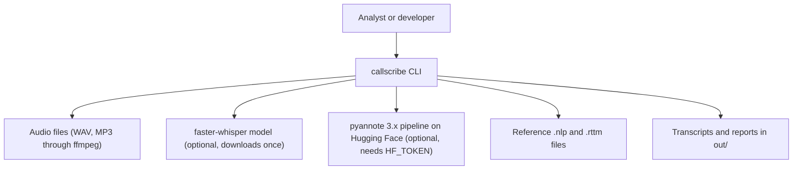
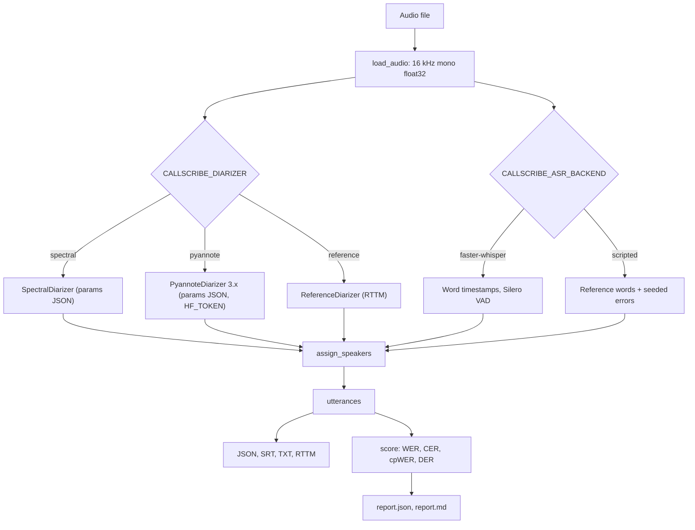

<div align="center">

# callscribe — Speaker-Attributed Transcripts for Earnings Calls

**callscribe is a transcription and evaluation toolkit for long business calls. It takes call audio through these steps to a transcript that names the speaker of each word:**

`decode` → `diarize` → `transcribe` → `align` → `export` → `score`.


**[Summary](#1-summary)** ·
**[Workflow](#4-the-end-to-end-workflow)** ·
**[Run it](#14-how-to-run-callscribe)** ·
**[Configuration](#144-environment-variables)** ·
**[Known problems](#17-known-problems)** ·
**[Glossary](#19-glossary)**

</div>

> [!NOTE]
> This README uses ASD-STE100 Simplified Technical English. The writing rules and the project
> vocabulary are in [`docs/ste-style-guide.md`](docs/ste-style-guide.md). Each term in the
> [Glossary](#19-glossary) has only one meaning.

---

callscribe makes a speaker-attributed transcript of a long call, for example a quarterly earnings call.
A diarizer finds who talks when, an ASR backend finds the words, and an aligner gives each word a speaker.
The main idea is one pipeline for all uses: the CLI, the evaluation and the tuning call the same `CallPipeline.run`.
Thus each reported WER, cpWER and DER describes the configured system.
The full pipeline runs offline on synthetic calls, with no model download and no token.

This README is the **one location that explains all of callscribe**. It gives these topics:

- the general design
- each component and its procedure, step by step
- the decision rules
- the data map
- the runbook
- the validation results and the known problems

| If you are… | Read |
|---|---|
| A manager or reviewer | [1](#1-summary), [3](#3-design-rules), [4](#4-the-end-to-end-workflow), [16](#16-validation-results), [18](#18-key-points) |
| A developer who joins the project | All sections, in sequence. Keep [14](#14-how-to-run-callscribe) and [17](#17-known-problems) open while you work |
| An operator who runs callscribe | [14](#14-how-to-run-callscribe), then the section for the component that you use |

---

## Table of contents

1. 🧭 [Summary](#1-summary)
2. 🏗️ [How callscribe is built](#2-how-callscribe-is-built)
   - 2.1 [Components](#21-components)
   - 2.2 [System context](#22-system-context)
   - 2.3 [Repository layout](#23-repository-layout)
3. 🛡️ [Design rules](#3-design-rules)
4. 🔄 [The end-to-end workflow](#4-the-end-to-end-workflow)
   - 4.1 [Full flow](#41-full-flow)
   - 4.2 [The life cycle of one call](#42-the-life-cycle-of-one-call)
5. 🎧 [Audio decoding and VAD](#5-audio-decoding-and-vad)
6. ✂️ [The chunk planner](#6-the-chunk-planner)
7. 🔵 [The ASR backends](#7-the-asr-backends)
8. 🟢 [The diarizers](#8-the-diarizers)
9. 🟣 [Alignment and utterances](#9-alignment-and-utterances)
10. ⚖️ [The metrics](#10-the-metrics)
11. 🧪 [Evaluation and tuning](#11-evaluation-and-tuning)
12. 📤 [Exports and speaker statistics](#12-exports-and-speaker-statistics)
13. 🗂️ [Data and file map](#13-data-and-file-map)
14. ▶️ [How to run callscribe](#14-how-to-run-callscribe)
    - 14.1 [Prerequisites](#141-prerequisites) · 14.2 [Installation](#142-installation) · 14.3 [Run callscribe](#143-run-callscribe) · 14.4 [Environment variables](#144-environment-variables)
15. 🧩 [How to extend callscribe](#15-how-to-extend-callscribe)
16. ✅ [Validation results](#16-validation-results)
17. ⚠️ [Known problems](#17-known-problems)
18. 📌 [Key points](#18-key-points)
19. 📖 [Glossary](#19-glossary)
20. 📄 [License](#20-license)

---

## 1. Summary

**The problem.** An earnings call is one hour of audio with several speakers. An analyst wants each word with the correct speaker. These questions are difficult:

- How do you cut one hour of audio for an ASR model and keep each word exactly once?
- How do you give each word the correct speaker?
- How do you set the diarizer parameters without a guess?
- Which metric tells you that a transcript is good? Word overlap does not.
- How do you prove that the scored transcript is the output of the real system?

callscribe gives each of these questions its own component. Each component has unit tests.

| Item | Value |
|---|---|
| Input | One audio file (WAV directly, MP3 and other formats through `ffmpeg`), or a manifest of calls |
| Output | A transcript (JSON, SRT, TXT, RTTM), speaker statistics, an evaluation report (JSON and Markdown) |
| Components | **17** modules: config, types, audio, vad, chunking, asr, diarize, align, pipeline, metrics, references, evaluate, tune, export, stats, synthetic, cli |
| ASR backends | `faster-whisper` (extra `asr`), `scripted` (offline simulator) |
| Diarizers | `pyannote` 3.x (extra `diarize`), `spectral` (offline), `reference` (oracle) |
| Metrics | WER with S/D/I, CER, cpWER, DER with collar |
| Offline mode | Synthetic calls, the scripted ASR and the spectral diarizer. No key and no network |
| Safety | `HF_TOKEN` is never printed. `callscribe config` shows only `set` or `not set` |
| Tests | **49** unit tests pass and **2** skip in CI (`pytest`). The 2 tests need the optional backends |


---

## 2. How callscribe is built

### 2.1 Components

| Component | Module | Purpose |
|---|---|---|
| Settings | `src/callscribe/config.py` | `Settings` from environment variables, `.env` loader, masked display |
| Data types | `src/callscribe/types.py` | `Word`, `Turn`, `Utterance`, `Transcript` |
| Audio | `src/callscribe/audio.py` | WAV reader and writer, `ffmpeg` pipe decoder, resampler, frame energy |
| VAD | `src/callscribe/vad.py` | Energy VAD with gap closing and short-island removal |
| Chunk planner | `src/callscribe/chunking.py` | Silence cuts, own regions, overlap, `ChunkedASR`, `merge_words` |
| ASR backends | `src/callscribe/asr.py` | `FasterWhisperASR`, `ScriptedASR` |
| Diarizers | `src/callscribe/diarize.py` | `SpectralDiarizer`, `PyannoteDiarizer`, `ReferenceDiarizer`, parameter files |
| Aligner | `src/callscribe/align.py` | `assign_speakers`, `utterances` |
| Pipeline | `src/callscribe/pipeline.py` | `CallPipeline.run`, `build_pipeline(settings)` |
| Metrics | `src/callscribe/metrics.py` | `normalize`, WER, CER, cpWER, DER |
| References | `src/callscribe/references.py` | `.nlp`, RTTM, manifest, Earnings-21 manifest builder, dev and test split |
| Evaluation | `src/callscribe/evaluate.py` | Score each call, pooled numbers, `report.json` and `report.md` |
| Tuning | `src/callscribe/tune.py` | Grid search on the dev split, objective pooled DER |
| Exports | `src/callscribe/export.py` | JSON, SRT, TXT, RTTM |
| Statistics | `src/callscribe/stats.py` | Talk time, share, turns, words per minute, text timeline |
| Synthetic calls | `src/callscribe/synthetic.py` | Tone-burst calls with exact references |
| CLI | `src/callscribe/cli.py` | The `callscribe` command with 7 subcommands |

### 2.2 System context



### 2.3 Repository layout

```
callscribe/
├── .github/workflows/ci.yml     # CI: Python 3.11, pip install -e ".[dev]", pytest -q
├── .env.example                 # every variable, all values empty
├── pyproject.toml               # package, extras (asr, diarize, all, dev), callscribe script
├── data/README.md               # Earnings-21 source, license, layout, download steps
├── docs/ste-style-guide.md      # writing rules and project vocabulary
├── src/callscribe/
│   ├── config.py  types.py               # settings and data types
│   ├── audio.py  vad.py  chunking.py     # decoding, speech regions, chunks
│   ├── asr.py  diarize.py  align.py      # words, turns, speaker for each word
│   ├── pipeline.py                       # the one pipeline
│   ├── metrics.py  references.py         # WER, cpWER, DER, reference files
│   ├── evaluate.py  tune.py              # evaluation harness and dev-split tuning
│   ├── export.py  stats.py               # output files and speaker statistics
│   └── synthetic.py  cli.py              # synthetic calls and the command line
└── tests/                                # 51 tests (49 run, 2 need optional backends)
```

---

## 3. Design rules

### 3.1 One pipeline for each use
`CallPipeline.run` is the only path from audio to a transcript. `callscribe transcribe`, `callscribe evaluate` and `callscribe tune` all use it. A test checks that the evaluated WER equals the WER of the pipeline output.

### 3.2 The right metric for each question
WER measures the words, with order and repeats. cpWER measures the words and the speakers together. DER measures the turns. The code does not use set overlap or embedding cosine as a quality metric, because they can be high for a bad transcript.

### 3.3 No word is cut or counted twice
`ChunkedASR` cuts in silences when possible and adds an overlap to each chunk. `merge_words` keeps a word only in the chunk whose own region contains the word midpoint. The faster-whisper backend has no token cap for each chunk.

### 3.4 Parameters come from a dev split
`callscribe tune` runs a grid search on the dev split and writes a JSON file. `tune` refuses an item from the test split. No diarizer threshold is tuned by hand in code.

### 3.5 Credentials stay private
`HF_TOKEN` is a hidden field of `Settings`. `repr(settings)` does not show it, and `callscribe config` shows only `set` or `not set`. A test fails if a notebook with outputs is in the repository.

### 3.6 Audio stays in memory
`load_audio` decodes MP3 through an `ffmpeg` pipe into memory. callscribe writes no converted WAV copy next to the input.

### 3.7 All results are pooled over many calls
The harness scores each call of a split. The pooled WER adds all errors and divides by all reference words. The pooled DER does the same with seconds.

---

## 4. The end-to-end workflow

### 4.1 Full flow



### 4.2 The life cycle of one call

1. The CLI reads the settings from the environment and the optional `.env` file.
2. `build_pipeline` makes the ASR backend and the diarizer that the settings name.
3. `load_audio` decodes the file into 16 kHz mono samples.
4. The diarizer returns turns with speaker labels.
5. The ASR backend returns words with start and end times.
6. `assign_speakers` gives each word the speaker of the turn with the largest overlap.
7. `utterances` groups the words at each speaker change and at each pause longer than 1 s.
8. `write_outputs` writes the transcript files.
9. In an evaluation, `score` compares the transcript with the `.nlp` and `.rttm` references.

---

## 5. Audio decoding and VAD

**Purpose.** Give each later stage the same 16 kHz mono samples and the speech regions.

| Input | Output |
|---|---|
| WAV, MP3, FLAC or M4A file | `float32` samples at 16 kHz, speech regions in seconds |

**Procedure**

1. If the file is WAV, read it with the standard `wave` module. Average the channels and resample with a polyphase filter.
2. Else, start `ffmpeg` and read raw 16-bit samples from its standard output.
3. Calculate the energy of each 25 ms frame with a 10 ms hop.
4. Mark a frame as speech if its level is 18 dB above the 10th percentile of all frames.
5. Close gaps shorter than 0.25 s. Remove speech islands shorter than 0.10 s.

**Rules**

- If `ffmpeg` is not installed, an MP3 file gives `AudioError` with an install message.
- 8-bit, 16-bit and 32-bit PCM WAV files are supported.

---

## 6. The chunk planner

**Purpose.** Let a short-input ASR model read a long call with no lost or repeated words.

| Input | Output |
|---|---|
| Duration, speech regions, `max_len` (default 30 s), `overlap` (default 1 s) | A list of `Chunk` objects: own region and audio window |

**Procedure**

1. Find the middle of each silence between two speech regions.
2. From the current time, find the latest silence middle before `current + max_len`.
3. If there is one, cut there. Else, cut at `current + max_len`.
4. Repeat until the rest of the call is shorter than `max_len`.
5. Give each chunk an audio window: its own region plus `overlap` seconds on each side.
6. Transcribe each window. Move the word times to call time.
7. Keep each word only in the chunk whose own region contains the word midpoint.

**Rules**

- The own regions cover the timeline with no gap and no overlap.
- The faster-whisper backend reads long audio itself. `build_pipeline` does not wrap it. Wrap only a short-input backend in `ChunkedASR`.

---

## 7. The ASR backends

| Backend | Setting | What it does | Needs |
|---|---|---|---|
| `faster-whisper` | `CALLSCRIBE_ASR_BACKEND=faster-whisper` | Whisper (`large-v3` by default) with word timestamps, Silero VAD, beam 5, no conditioning on the previous text | Extra `asr`, a model download |
| `scripted` | `CALLSCRIBE_ASR_BACKEND=scripted` (default) | Returns the reference words of the audio window with seeded substitutions (5%), deletions (3%) and insertions (2%) | A `.nlp` file next to the audio |

**Rules**

- The scripted ASR is a simulator. Its WER shows that the metric code works. It does not measure speech recognition.
- The errors of the scripted ASR come from a hash of the seed and the word index. Thus chunking does not change them.
- A word that is not fully inside the audio window is not heard by the scripted ASR. This makes a hard cut lose words, as a real model does.

---

## 8. The diarizers

| Diarizer | Setting | What it does |
|---|---|---|
| `spectral` | `CALLSCRIBE_DIARIZER=spectral` (default) | Log energy in 32 bands for each 1 s window (0.5 s step), cosine distance, average-linkage clustering |
| `pyannote` | `CALLSCRIBE_DIARIZER=pyannote` | `pyannote/speaker-diarization-3.1` on in-memory audio, parameters merged from a JSON file |
| `reference` | `CALLSCRIBE_DIARIZER=reference` | Returns the RTTM turns. Use it to measure the ASR alone |

**Procedure of the spectral diarizer**

1. Detect the speech frames with the VAD.
2. For each window with at least 30% speech, average the log band energies of its speech frames.
3. Subtract the mean of the vector and divide by its length.
4. Cluster the vectors. If the speaker count is known, cut the tree at that count. Else, cut at `threshold`.
5. Give each speech frame the cluster of the nearest window center.
6. Join same-speaker turns with a gap below `min_duration_off`. Remove turns shorter than `min_duration_on`.
7. Name the speakers `SPEAKER_00`, `SPEAKER_01`, … in order of their first turn.

| Spectral parameter | Default | Tuned on the synthetic dev split |
|---|---|---|
| `threshold` | 0.15 | 0.02 |
| `min_duration_off` | 0.3 s | 0.3 s |
| `min_duration_on` | 0.2 s | (not tuned) |
| `window`, `step` | 1.0 s, 0.5 s | (not tuned) |

**Rules**

- The spectral diarizer separates the synthetic voices. It is not a replacement for a neural speaker embedding on real calls.
- The pyannote diarizer needs `HF_TOKEN` and accepted model terms on Hugging Face.

---

## 9. Alignment and utterances

**Purpose.** Give each word one speaker label, then make readable utterances.

**Procedure**

1. For each word, add the overlap time of the word with the turns of each speaker.
2. If a speaker has overlap, give the word the speaker with the largest overlap.
3. Else, give the word the speaker of the nearest turn within 0.5 s.
4. Else, give the word the label `UNKNOWN`.
5. Start a new utterance at each speaker change and at each pause longer than 1.0 s.

---

## 10. The metrics

| Metric | Definition | Module rule |
|---|---|---|
| WER | (S + D + I) / reference words after `normalize` | S, D and I come from a backtrace if reference × hypothesis ≤ 20,000,000 cells. Else only the total is given |
| CER | Character edit distance / reference characters | NaN if a text is longer than 20,000 characters |
| cpWER | Sum of the edit distances of the speaker streams after the best mapping / reference words | The Hungarian algorithm finds the mapping. An unmatched stream counts as deletions or insertions |
| DER | (missed + false alarm + confusion) / reference speech | 10 ms frames, collar 0.25 s on each side of each reference boundary, optimal speaker mapping |

| `normalize` step | Example |
|---|---|
| Lower case | `Revenue` → `revenue` |
| `%` and `&` | `12%` → `12 percent`, `R&D` → `r and d` |
| Thousands separator | `1,000` → `1000` |
| Punctuation removal | `improved!` → `improved` |
| Filler removal (default) | `uh`, `um`, `hmm`, `mm`, `mhm`, `ah`, `er`, `erm` |

The edit distance uses one NumPy row operation for each reference word. Thus a one-hour call (about 10,000 words) takes seconds, not hours.

---

## 11. Evaluation and tuning

**Purpose.** Score the configured pipeline on a split of a manifest, and tune the diarizer on the dev split.

**Procedure of the evaluation**

1. Read the manifest items of the split (`dev`, `test` or `all`).
2. For each call, build the pipeline and run it on the decoded audio.
3. If `--oracle-speakers` is set, give the diarizer the true speaker count.
4. Score the transcript: WER, S/D/I, CER, cpWER and, if an RTTM file exists, DER.
5. Pool the errors over all calls.
6. Write `report.json` and `report.md`.

**Procedure of the tuning**

1. Read the dev items. They must have RTTM files.
2. For each parameter set of the grid, diarize each dev call and add the DER errors.
3. Select the set with the lowest pooled DER.
4. Write the parameters and the metadata (split, file count, best DER) to a JSON file.

| Grid | Values |
|---|---|
| Spectral `threshold` | 0.02, 0.03, 0.05, 0.08, 0.1, 0.15, 0.25 |
| Spectral `min_duration_off` | 0.1, 0.3, 0.6 |
| pyannote `clustering.threshold` | 0.6, 0.7, 0.8 |
| pyannote `segmentation.min_duration_off` | 0.0, 0.1, 0.3 |

**Rules**

- The Earnings-21 manifest builder puts about 25% of the calls in the dev split, from a hash of the file ID.
- The synthetic data set puts every fourth call in the dev split.

---

## 12. Exports and speaker statistics

| Format | Content |
|---|---|
| `.json` | Metadata (backends, timings), utterances, words with speakers and probabilities, turns |
| `.srt` | One subtitle for each utterance, with the speaker label |
| `.txt` | `SPEAKER_00 [00:00:00.500 - 00:00:04.788]: text` |
| `.rttm` | One `SPEAKER` line for each turn |

`callscribe stats <transcript.json>` prints the talk time, share, turn count, word count, words per minute and longest turn of each speaker. It also prints a text timeline with one row for each speaker.

---

## 13. Data and file map

| Path | Committed? | Contents |
|---|---|---|
| `data/README.md` | Yes | Earnings-21 source, license, layout, download steps |
| `data/speech-datasets/` | No (git ignores it) | The Earnings-21 clone |
| `data/synthetic/` | No (git ignores it) | Output of `callscribe synth` |
| `*.wav`, `*.mp3`, `*.flac`, `*.m4a` | No (git ignores them) | Audio |
| `manifest.json`, `data/*.json` | No (git ignores them) | Manifests |
| `configs/diarizer_params.json` | Your choice | Output of `callscribe tune` |
| `out/` | No (git ignores it) | Transcripts and reports |
| `.env.example` | Yes | All 10 variables, empty |
| `.env` | No (git ignores it) | Local settings and `HF_TOKEN` |

---

## 14. How to run callscribe

### 14.1 Prerequisites

| Need | For |
|---|---|
| Python 3.11+ | All components |
| `numpy>=1.24`, `scipy>=1.10` | All components (installed with the package) |
| `ffmpeg` on the `PATH` | MP3 and other compressed formats |
| `faster-whisper>=1.0` (extra `asr`) | Real speech recognition |
| `pyannote.audio>=3.1`, `torch>=2.1` (extra `diarize`) and `HF_TOKEN` | Neural diarization |
| A GPU | Recommended for `large-v3` and pyannote on one-hour calls |

### 14.2 Installation

```bash
git clone https://github.com/KrishnaAnnavaram/callscribe.git
cd callscribe
python -m venv .venv
. .venv/bin/activate            # Windows: .venv\Scripts\activate
pip install -e ".[dev]"         # add ,asr,diarize (or ,all) for the real backends
cp .env.example .env            # optional
```

### 14.3 Run callscribe

Offline (no download, no token):

```bash
callscribe synth --out data/synthetic --calls 12
callscribe tune --manifest data/synthetic/manifest.json --out configs/diarizer_params.json
callscribe evaluate --manifest data/synthetic/manifest.json --diarizer-params configs/diarizer_params.json --out out/eval
callscribe transcribe data/synthetic/synth001.wav --diarizer-params configs/diarizer_params.json --out out
callscribe stats out/synth001.json
callscribe config
```

With the real backends and Earnings-21 (see `data/README.md`):

```bash
# .env
CALLSCRIBE_ASR_BACKEND=faster-whisper
CALLSCRIBE_DIARIZER=pyannote
CALLSCRIBE_DEVICE=cuda
CALLSCRIBE_COMPUTE_TYPE=float16
HF_TOKEN=<your token>

callscribe manifest --root data/speech-datasets/earnings21 --out data/earnings21.json
callscribe tune --manifest data/earnings21.json --diarizer pyannote --out configs/pyannote_params.json
callscribe evaluate --manifest data/earnings21.json --split test --diarizer-params configs/pyannote_params.json --out out/earnings21
callscribe transcribe data/speech-datasets/earnings21/media/4320211.mp3 --out out
```

### 14.4 Environment variables

| Variable | Used by | Meaning |
|---|---|---|
| `CALLSCRIBE_ASR_BACKEND` | Pipeline | `scripted` (default) or `faster-whisper` |
| `CALLSCRIBE_ASR_MODEL` | faster-whisper | Model name. Default `large-v3` |
| `CALLSCRIBE_LANGUAGE` | faster-whisper | Language code. Default `en` |
| `CALLSCRIBE_DEVICE` | faster-whisper, pyannote | `cpu` (default) or `cuda` |
| `CALLSCRIBE_COMPUTE_TYPE` | faster-whisper | Default `int8`. Use `float16` on a GPU |
| `CALLSCRIBE_DIARIZER` | Pipeline | `spectral` (default), `pyannote` or `reference` |
| `CALLSCRIBE_PYANNOTE_PIPELINE` | pyannote | Default `pyannote/speaker-diarization-3.1` |
| `CALLSCRIBE_DIARIZER_PARAMS` | Diarizers | Path to a JSON file from `callscribe tune`. Empty: defaults |
| `CALLSCRIBE_OUT_DIR` | `transcribe` | Output folder. Default `out` |
| `HF_TOKEN` | pyannote | Hugging Face token. Never printed |

An unknown backend or diarizer name causes an error at start.
Credentials are only in a local `.env` file. Git ignores this file. Do not print or commit credentials.

---

## 15. How to extend callscribe

| You want to… | Do this | Code change? |
|---|---|---|
| Use a smaller Whisper model | Set `CALLSCRIBE_ASR_MODEL=small` | No |
| Add Earnings-22 | Run `callscribe manifest` on the Earnings-22 folder | No |
| Add an ASR backend (for example WhisperX) | Make a class with `name` and `transcribe(x, sr, offset)`. Add it to `build_pipeline` | Small |
| Use a short-input ASR model | Wrap it in `ChunkedASR(inner, max_len, overlap)` | Small |
| Add a diarizer | Make a class with `name` and `diarize(x, sr, num_speakers)`. Add it to `build_pipeline` | Small |
| Add JER or a speaker-attributed WER variant | Add a function to `metrics.py` and a field to `FileResult` | Small |
| Add an LLM summary of each call | Add a stage after `utterances` behind an interface with an offline fake | Yes |

---

## 16. Validation results

| Validation | Result | Command |
|---|---|---|
| Unit tests | **49 passed, 2 skipped** in CI (faster-whisper and pyannote are not installed) | `pytest -q` |
| Synthetic test split, default parameters | Pooled WER 0.059, cpWER 1.082, DER 0.523 | `callscribe evaluate --manifest data/synthetic/manifest.json` |
| Synthetic test split, tuned on dev | Pooled WER 0.059, cpWER 0.059, DER 0.000 | `callscribe evaluate ... --diarizer-params configs/diarizer_params.json` |
| Synthetic test split, true speaker count | DER 0.000 | `callscribe evaluate ... --oracle-speakers` |
| Synthetic test split, reference diarizer | DER 0.000, cpWER = WER | `callscribe evaluate ... --diarizer reference` |

The synthetic data set has 12 calls (seed 0): 3 dev calls and 9 test calls. The test calls have 1,134 reference words and 2 to 4 speakers.
The WER of 0.059 comes from the SCRIPTED ASR, which adds errors on purpose. It proves that the WER code counts errors correctly. It says nothing about Whisper.
The DER numbers come from the real spectral diarizer on SYNTHETIC tone-burst voices. These voices are much easier to separate than human voices.
With the default threshold of 0.15, the diarizer finds one speaker in most calls, and cpWER becomes larger than 1. The tuned threshold of 0.02 fixes this. The result shows why tuning on a dev split is necessary.
No Earnings-21 result is reported here. The prototype reported only word-overlap and cosine scores of a different transcript, so there is no prototype number to compare.

---

## 17. Known problems

Read these problems before you use callscribe in production.

| # | Area | Problem | Impact and action |
|---|---|---|---|
| 1 | Results | No Earnings-21 WER, cpWER or DER is measured in this repository | Run `callscribe evaluate` with the real backends on the test split and publish the pooled numbers |
| 2 | DER references | The Earnings-21 `.nlp` files have speaker labels but often no times | DER needs RTTM files. Without them, the report gives WER and cpWER only |
| 3 | Spectral diarizer | Band energies separate synthetic voices, not human voices in a phone call | Use `pyannote` for real calls, tuned on the dev split |
| 4 | Normalisation | Number words and digits are different tokens (`twenty` and `20`) | WER on real calls is higher than with the Whisper English normaliser |
| 5 | Overlapped speech | The aligner gives each word only one speaker | Words in overlapped speech can get the wrong speaker |
| 6 | Optional backends | CI does not run faster-whisper or pyannote. Their adapters are not tested | Run them locally before you trust a real result |
| 7 | Long calls | CER returns NaN above 20,000 characters, and S/D/I are not given above 20,000,000 cells | The total WER is always exact |
| 8 | Scale | The pyannote and Whisper models need a GPU for one-hour calls in reasonable time | Use `CALLSCRIBE_DEVICE=cuda` |

---

## 18. Key points

1. **One pipeline for each use.** The CLI, the evaluation and the tuning call the same `CallPipeline.run`.
2. **WER, cpWER and DER replace word overlap.** Each metric answers one question: words, words with speakers, turns.
3. **No word is cut or counted twice.** Chunks cut in silences, overlap, and keep each word by its midpoint.
4. **Parameters come from the dev split.** On the synthetic test split, tuning reduced DER from 0.523 to 0.000.
5. **The token is never printed.** `HF_TOKEN` is hidden in `Settings` and in all CLI output.
6. **The full demo runs offline.** 49 tests run with no model, no network and no token.

---

## 19. Glossary

| Term | Meaning |
|---|---|
| **ASR backend** | The component that changes audio into words: `faster-whisper` or `scripted` |
| **Call** | One audio recording of an earnings call |
| **Chunk** | One audio window that a short-input ASR receives, with its own region |
| **Collar** | The time around each reference boundary that DER does not score |
| **cpWER** | WER of the speaker streams after the best speaker mapping |
| **DER** | Diarization error rate: (missed + false alarm + confusion) / reference speech |
| **Dev split** | The calls that tuning uses |
| **Diarizer** | The component that finds who talks when |
| **Manifest** | The JSON list of calls with audio, references and split |
| **Own region** | The part of a chunk that keeps the words whose midpoint is in it |
| **Pooled** | Summed over all calls before the division |
| **Reference** | The true words, speakers or turns of a call |
| **Scripted ASR** | The offline simulator that returns reference words with seeded errors |
| **Speech region** | A time span that the VAD marks as speech |
| **Test split** | The calls that the evaluation reports |
| **Turn** | A time span in which one speaker talks |
| **Utterance** | Consecutive words of one speaker with no long pause |
| **VAD** | Voice activity detection |
| **WER** | Word error rate after normalisation |

---

## 20. License

[MIT](LICENSE) © 2026 Krishna Annavaram
